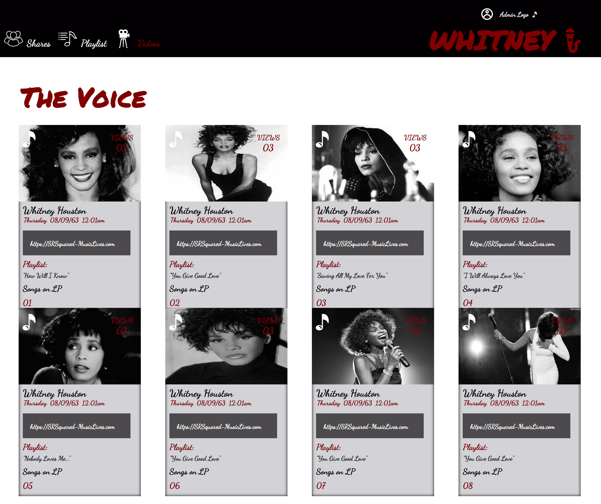

### STATIC COMP 2 1705- MOD1###

This is my rendition of a card UI for a recruiting firm. My version pays tribute to the late Whitney Houston in black and white photos displaying the singer at the height of her beauty and incredible talent.

The original comp (see below) was for a desktop view. The challenge was to replicate layout only, however styling and theme was left open. I have since, made an edit on the spacing between the top and bottom row of cards.

-------

###Original Comp###

Below are a series of my version, which I themed as a site on which users can share and save recipes.

------------

###The Voice###

